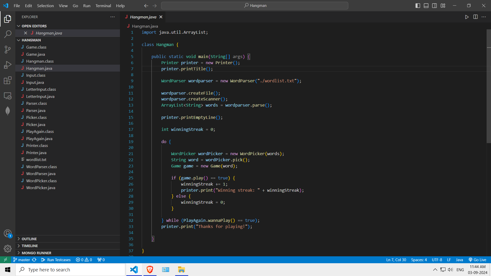
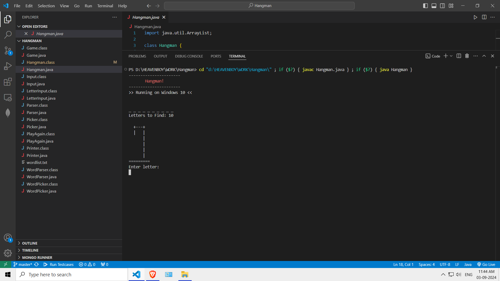
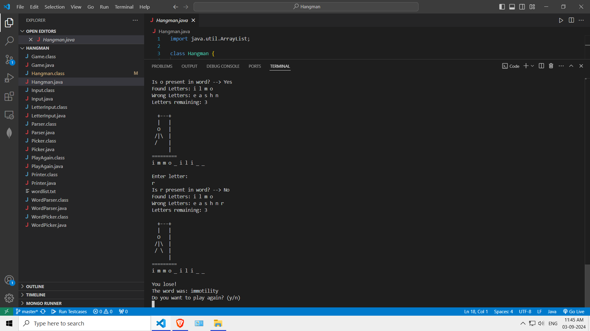
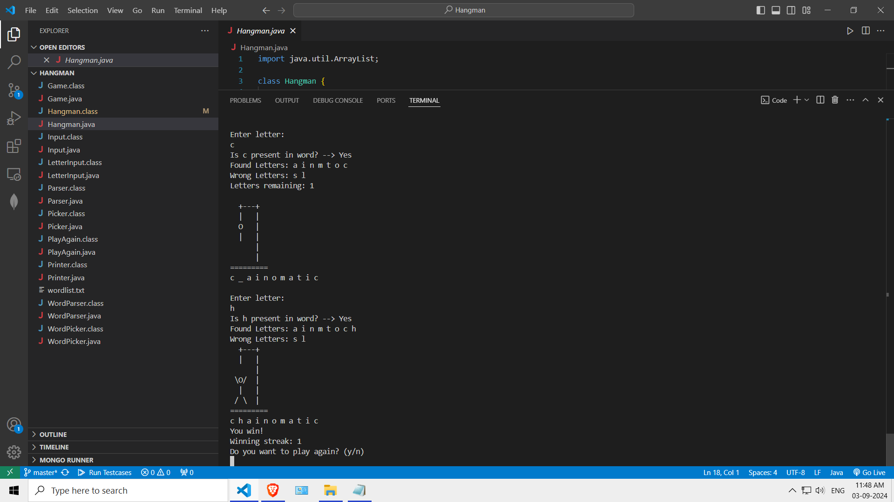

# Hangman
## Description
The Hangman game is made using Java only using the Object Oriented Programming concepts to create and use modules in different parts of the project.

## Software Version
- openjdk version "11.0.16.1" 2022-08-12 LTS
- OpenJDK Runtime Environment Microsoft-40648 (build 11.0.16.1+1-LTS)
- OpenJDK 64-Bit Server VM Microsoft-40648 (build 11.0.16.1+1-LTS, mixed mode)
- Visual Studio Version: Microsoft Visual Studio Community 2019 Version 16.11.31
  
### Installing Dependencies
- You only need the java to be installed on your system for this project.
- You can take help to install java form here : https://www.java.com/en/download/help/download_options.html

### Project File/Configuration ScreenShots
Project Files             |  In Project Preview
:-------------------------:|:-------------------------:
  |  
  |  

## Running
- Open the folder in the visual studio or other IDE then run the Hangman file. The game will run.
